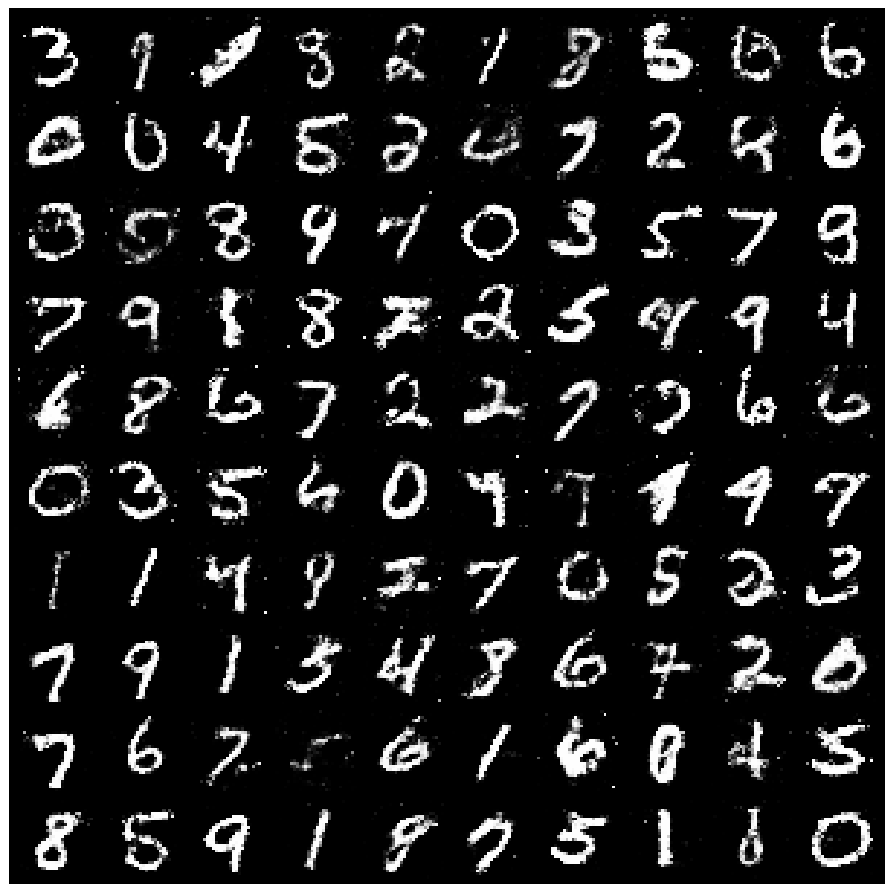
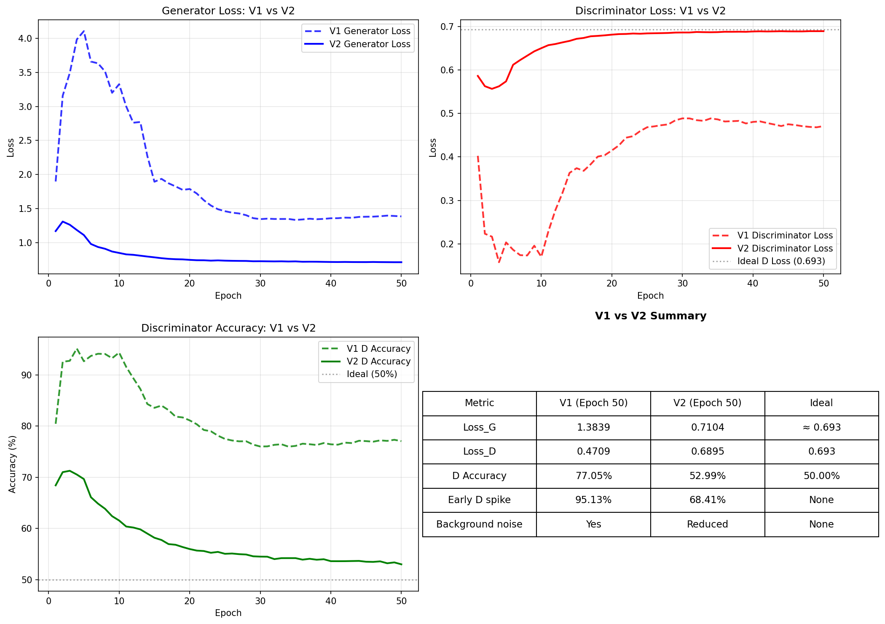

# GAN for MNIST Digit Generation

A Generative Adversarial Network (GAN) trained on the MNIST 
dataset using PyTorch. The Generator learns to produce 
realistic handwritten digit images indistinguishable from 
real ones.



---

## Project Overview

This project consists of three main components:

1. **GAN (Generator + Discriminator)** — trained on 60,000 
   MNIST images to generate realistic fake digits
2. **Fake Dataset (S1)** — 100 curated fake digit images 
   generated by the trained Generator
3. **CNN Classifier** — trained on MNIST to evaluate the 
   quality of generated images by comparing classification 
   errors on real (S0) vs fake (S1) digits

---

## Results

| Metric | Value |
|--------|-------|
| GAN D Accuracy (Epoch 50) | 52.99% |
| GAN Loss_G (Epoch 50) | 0.7104 |
| GAN Loss_D (Epoch 50) | 0.6895 |
| Classifier Test Accuracy | 99.36% |
| S0 Classification Error | 1.00% |
| S1 Classification Error | 3.00% |

The D Accuracy of ~53% at epoch 50 is very close to the 
theoretical ideal of 50%, meaning the Discriminator is 
essentially guessing — strong evidence that the Generator 
successfully learned the real MNIST distribution.

---

## Architecture

### Generator (V2)
Input  : Random noise z ~ N(0,1) — 100 dimensions
FC(100→256) → BatchNorm → ReLU
FC(256→512) → BatchNorm → ReLU
FC(512→1024) → BatchNorm → ReLU
FC(1024→784) → Tanh
Output : 28×28 grayscale image

### Discriminator (V2)
Input  : Flattened image — 784 dimensions
FC(784→512) → LeakyReLU(0.2) → Dropout(0.3)
FC(512→256) → LeakyReLU(0.2) → Dropout(0.3)
FC(256→128) → LeakyReLU(0.2) → Dropout(0.3)
FC(128→1)   → Sigmoid
Output : Probability of being real [0,1]

### Classifier (V2)
Input  : 28×28 grayscale image
Conv(1→32)  → BatchNorm → ReLU → MaxPool  → 14×14
Conv(32→64) → BatchNorm → ReLU → MaxPool  → 7×7
Conv(64→128)→ BatchNorm → ReLU → MaxPool  → 3×3
Flatten → FC(1152→256) → ReLU → Dropout(0.5)
FC(256→10)
Output : 10 class scores (digits 0–9)

---

## Training Progress

GAN training over 50 epochs showing Generator improvement:

| Epoch | Loss_G | Loss_D | D Accuracy |
|-------|--------|--------|------------|
| 1  | 1.1677 | 0.5864 | 68.41% |
| 10 | 0.8467 | 0.6503 | 61.54% |
| 20 | 0.7449 | 0.6814 | 55.97% |
| 30 | 0.7247 | 0.6864 | 54.49% |
| 40 | 0.7137 | 0.6888 | 53.60% |
| 50 | 0.7104 | 0.6895 | 52.99% |



---

## V1 vs V2 Improvements

| Improvement | V1 | V2 |
|-------------|----|----|
| BatchNorm in G | ✗ | ✓ |
| Dropout in D | ✗ | ✓ |
| Hidden layers | 2 | 3 |
| D Accuracy (Ep 50) | 77.05% | 52.99% |
| Early D spike | 95.13% | 68.41% |

---

## Project Structure
GAN-MNIST/
├── README.md
├── requirements.txt
├── .gitignore
├── src/
│   ├── config.py          ← hyperparameters and paths
│   ├── models.py          ← Generator, Discriminator, Classifier
│   ├── train_gan.py       ← GAN training loop
│   ├── train_classifier.py← Classifier training loop
│   ├── evaluate.py        ← S0 and S1 evaluation
│   └── utils.py           ← helper functions
├── app/
│   └── streamlit_app.py   ← interactive web demo
├── notebooks/
│   └── GAN_MNIST.ipynb    ← full training notebook (Colab)
├── outputs/               ← training plots and grids
├── results/               ← evaluation results
└── Fake_Digits/           ← 100 curated fake digit images

---

## How to Run

### 1. Clone the repository
```bash
git clone https://github.com/pas08/GAN-MNIST.git
cd GAN-MNIST
```

### 2. Create virtual environment
```bash
python -m venv venv

# Windows
venv\Scripts\activate

# Mac/Linux
source venv/bin/activate
```

### 3. Install dependencies
```bash
pip install -r requirements.txt
```

### 4. Run the Streamlit demo
```bash
streamlit run app/streamlit_app.py
```

> **Note:** Training was done on Google Colab with a T4 GPU.
> The pretrained models are included in the repository.
> You do not need to retrain to run the demo.

---

## Streamlit Demo

The interactive demo allows you to:
- Generate new digit images in real time
- See the latent vector z that produced each image
- Classify generated images using the trained CNN

---

## References

1. I. J. Goodfellow et al., "Generative Adversarial 
   Networks," arXiv:1406.2661, 2014.
2. A. Radford et al., "Unsupervised Representation Learning 
   with Deep Convolutional GANs," arXiv:1511.06434, 2015.
3. PyTorch DCGAN Tutorial — 
   https://pytorch.org/tutorials/beginner/dcgan_faces_tutorial.html
4. torchvision.datasets.ImageFolder — 
   https://pytorch.org/vision/stable/datasets.html

---

## Author

**P.A. Gunawardana**
GitHub: https://github.com/pas08